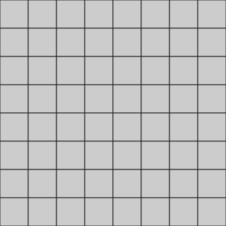

# 🎨 Issue-Ink 
## 🌍 The Global Rorschach Canvas

A slow-motion collaborative art experiment powered entirely by GitHub.

No servers.  
No database.  
Just Issues → Actions → SVG.

---

## 🖼 Live Canvas



---

## 🎨 How To Paint

1. Go to the **Issues** tab.
2. Click **New Issue**.
3. Use this exact format in the **title**:

```
Paint [A5] #FF5733
```

That’s it.

If valid, your pixel will be painted automatically.

---

## 📏 Valid Coordinates

Rows: **A–H**  
Columns: **1–8**

Examples:

- `Paint [A1] #FF0000`
- `Paint [H8] #00FFAA`

---

## ⏳ Game Rules

- 🕒 **One paint per user every 24 hours**
- 🔒 **Each painted tile is locked for 1 hour**
- Format must match exactly:
  `Paint [Coordinate] #HEXCODE`
- Coordinate must be between **A1 and H8**
- Color must be a valid **6-digit HEX code**
- Invalid format → Issue labeled `Invalid`
- Successful paint → Issue labeled `Completed`
- Every action is permanently recorded in `data/state.json`

---

## 🧠 What Is This?

The Global Rorschach Canvas is a shared 8×8 grid.

Anyone can paint.
Anyone can overwrite.
No one controls the outcome.

Patterns emerge.
Conflicts form.
Meaning is projected.

It’s not a picture.

It’s behavior.

---

## ⚙️ How It Works

- GitHub Issue = Input
- GitHub Action = Validation + Mutation
- SVG (`map.svg`) = Visual State
- `data/state.json` = Persistent Game State
- Git commit history = Permanent ledger

Everything happens publicly.

---

## 📜 Contributing

See [`CONTRIBUTING.md`](CONTRIBUTING.md) for formatting rules and philosophy.

---

Built entirely with GitHub Actions.  
Serverless. Deterministic. Transparent.
